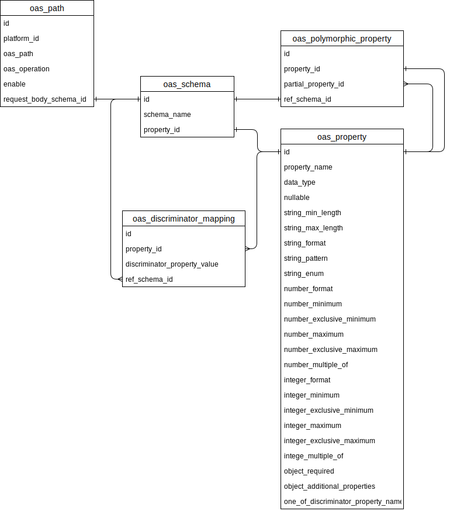

# Openapi CSV Converter



## Setup

```
pyenv virtualenv openapi-csv-converter
pyenv activate openapi-csv-converter
pip install -r requirements.txt
```

## VSCode integration (Optional)

1. Run command `Python: Select Intepreter`
2. Select `'openapi-csv-converter': venv`

## Usage

Openapi Spec -> CSV

```
python oas2csv.py -s ./sample/source-oas.yaml
```

CSV -> Openapi Spec

```
python csv2oas.py
```

## Test

```
pytest test_converter.py
```